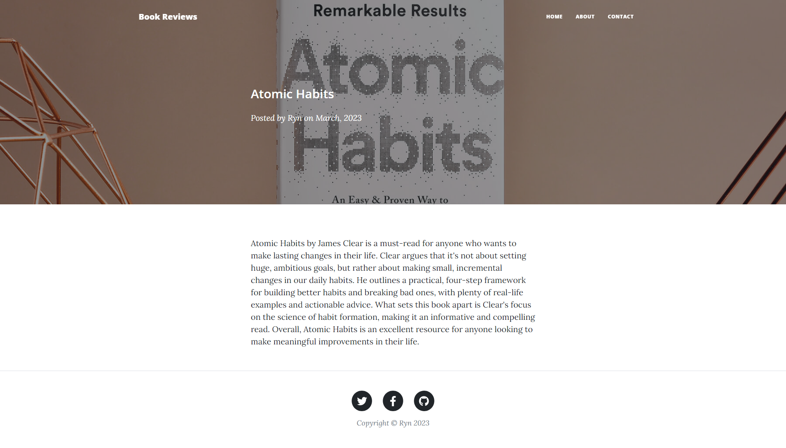
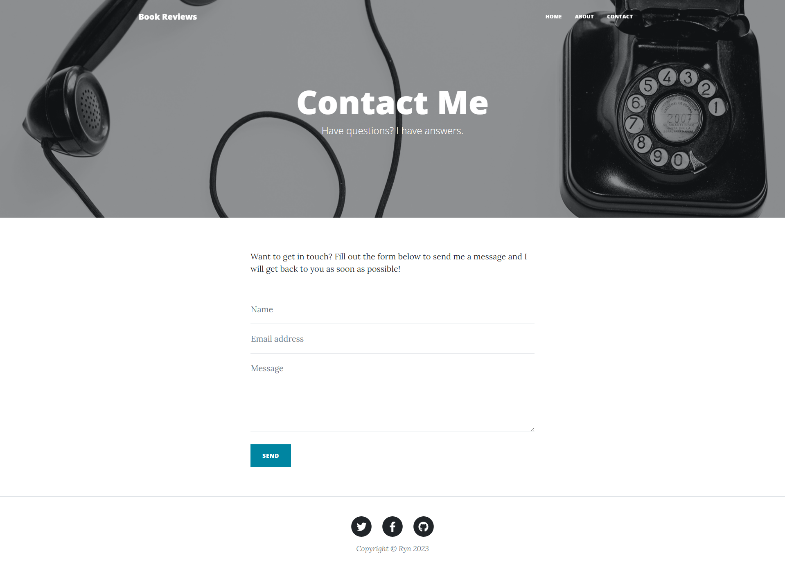
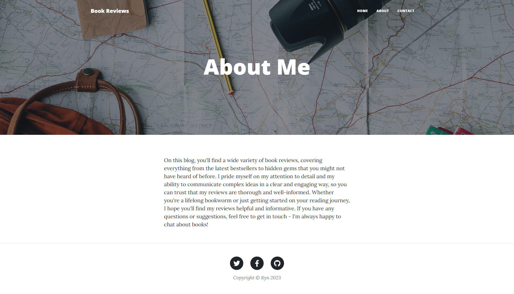

<h4 align ="center"> Upgraded this project & deployed the blog to Heroku </h4>
<h5 align= "center"> <a href="https://github.com/remarkeyable/day60blog"> File </a>
<h5 align= "center"> <a href="https://day60blog.herokuapp.com"> Live Demo </a>
   

 

  

  

      

  

