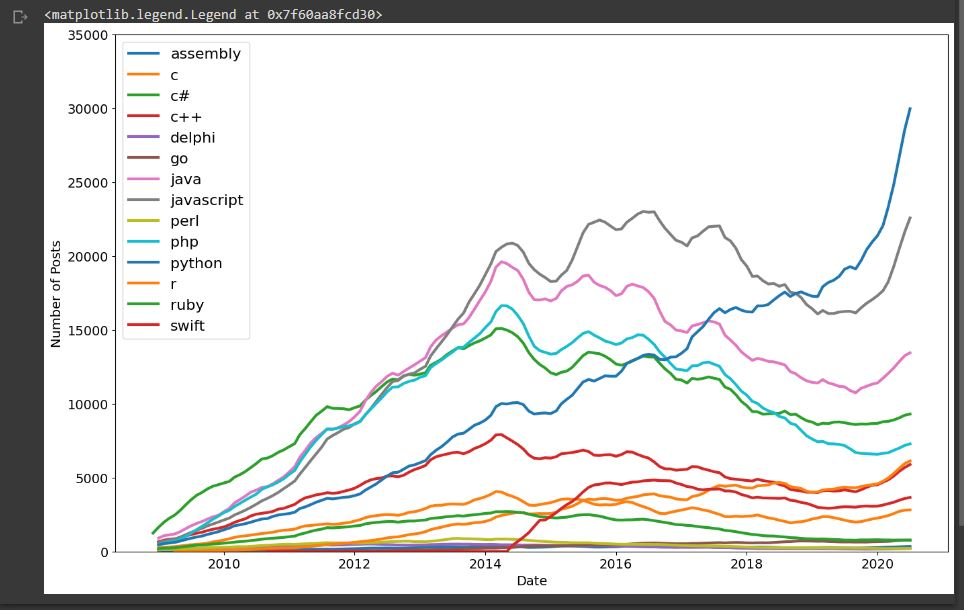

<h1>Learning Points & Summary</h1>

<ul>
<li>used .groupby() to explore the number of posts and entries per programming language</li>

<li>converted strings to Datetime objects with to_datetime() for easier plotting</li>

<li>reshaped our DataFrame by converting categories to columns using .pivot()</li>

<li>used .count() and isna().values.any() to look for NaN values in our DataFrame, which we then replaced using .fillna()</li>

<li>created (multiple) line charts using .plot() with a for-loop</li>

<li>styled our charts by changing the size, the labels, and the upper and lower bounds of our axis.</li>

<li>added a legend to tell apart which line is which by colour</li>

<li>smoothed out our time-series observations with .rolling().mean() and plotted them to better identify trends over time.</li> </ul>
 

