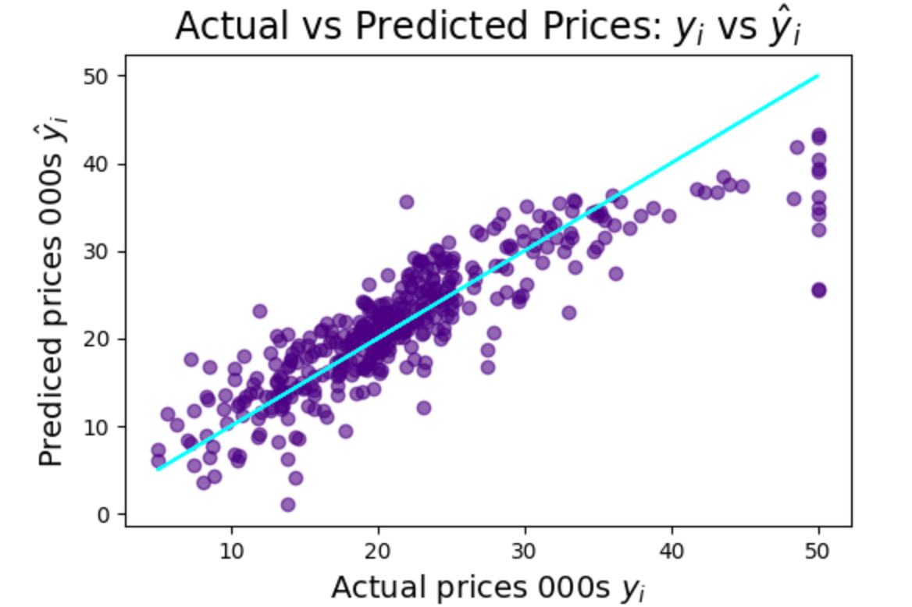

<h1>Learning Points & Summary</h1>
<ul>
  <li>How to quickly spot relationships in a dataset using Seaborn's .pairplot().</li>

<li>How to split the data into a training and testing dataset to better evaluate a model's performance.</li>

<li>How to run a multivariable regression.</li>

<li>How to evaluate that regression-based on the sign of its coefficients.</li>

<li>How to analyse and look for patterns in a model's residuals.</li>

<li>How to improve a regression model using (a log) data transformation.</li>

<li>How to specify your own values for various features and use your model to make a prediction.</li>
 

