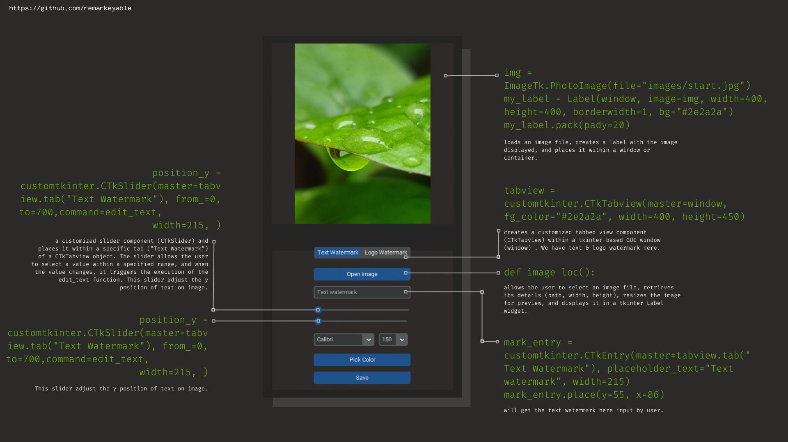
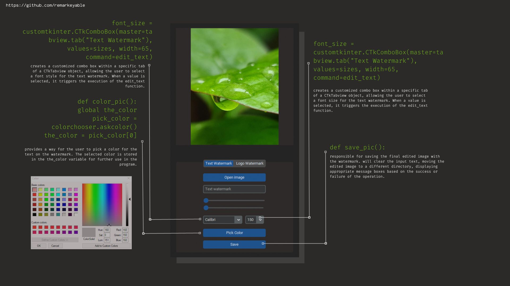
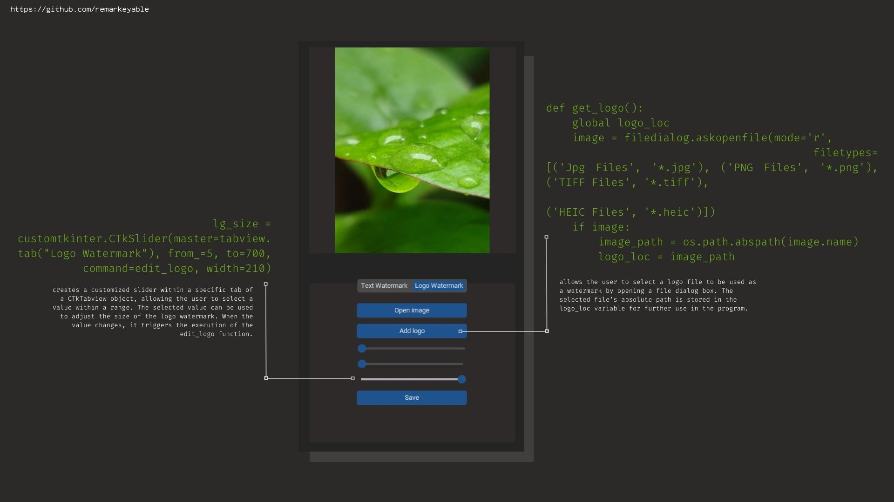
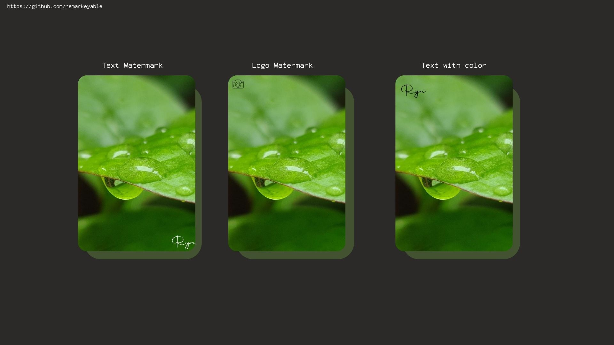

<h1> Image Watermarking </h1>
<h3> Functionality Details </h3>

           
            
           
            
           
  

  

<h3> Sample Output </h3>

           
        

  
<h3> Demo Video </h3>

https://github.com/remarkeyable/100-Days-of-Code-The-Complete-Python-Pro-Bootcamp/assets/122131469/6d365efd-0da5-41ac-9e8a-9e52c3d71967

