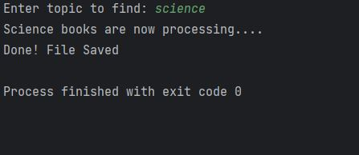
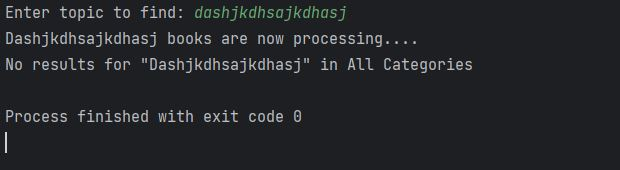
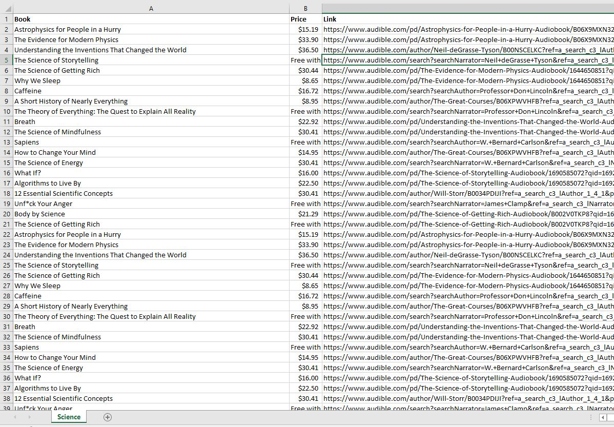

<h1>Overview</h1>

<h>I utilized the Selenium driver framework and CSV module  to accomplish this project. In the following example, I successfully scraped over 5000 details of audiobooks from audible.com in just a minute or two. </h4>

<h3>Output of a successful process</h3>

<h3>Output of a failed process</h3>

<h3>File</h3>
<a href="https://github.com/remarkeyable/100-Days-of-Code-The-Complete-Python-Pro-Bootcamp/blob/main/Day%2092/Science.csv"> CSV FILE </a>

