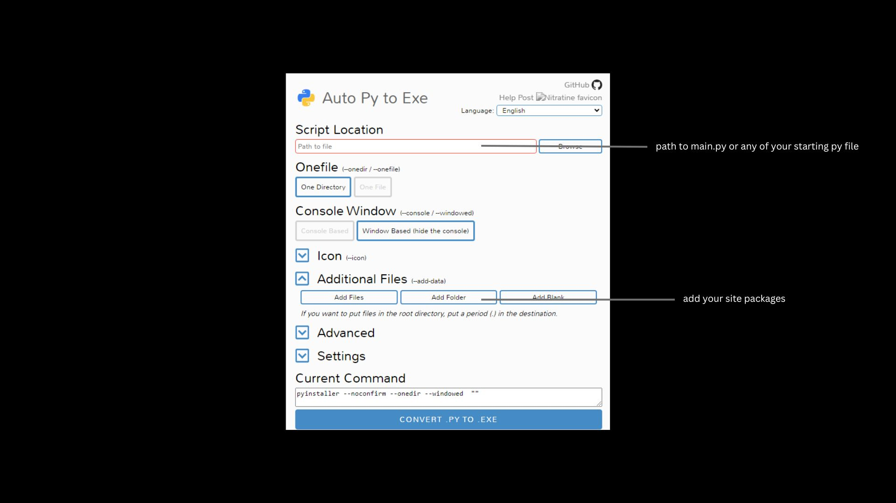

<h1>Custom Automation</h1>
<p>Automated a repetitive task. Certain outputs and codes are confidential and  have been intentionally concealed. I used openpyxl & customtkinter to complate this project. </p>
<p>In this project, I learned how to convert .py files into .exe files using auto_py_to_exe.</i></p>

<h4>Install auto_py_to_exe</h4>

```
pip install auto-py-to-exe
```
<h4>Open cmd and run the ff command</h4>

```
py -m auto_py_to_exe
```


<h4>Site packages are the modules included in your Python code. To navigate through site packages, follow this file path:</h4>
<pre>
C:\Users\username\AppData\Local\Programs\Python\Python311\Lib
</pre>


