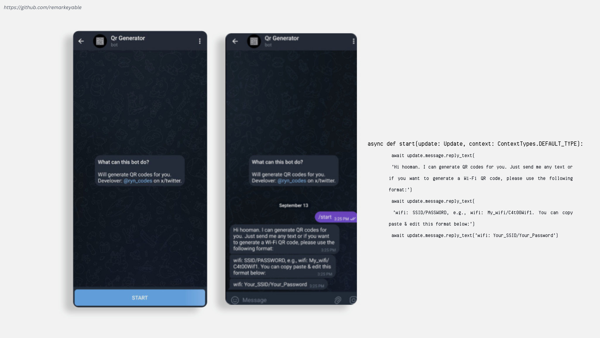
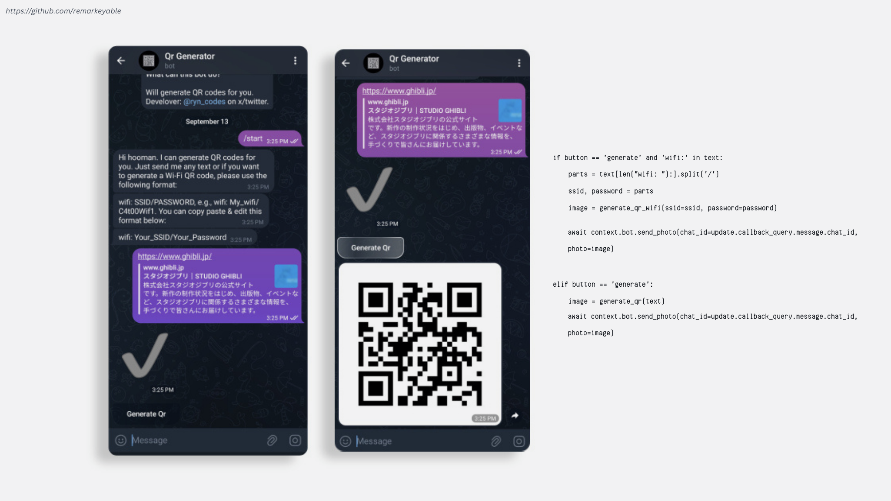
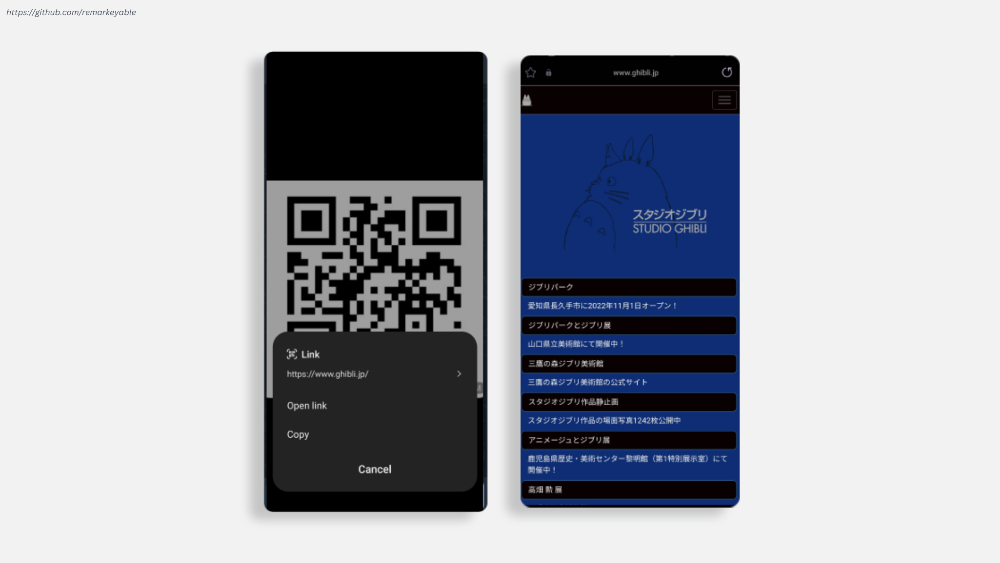

<h1>Overview</h1>

<a href="https://t.me/the_qrgeneratorbot"> BOT LIVE DEMO </a> 
<p><em> Necessary libraries & modules :</em> </p>

```
pip install python-telegram-bot
```
```
pip install qrcode
```
```
pip install typing-extensions
```
```
pip install os-sys
```
<kbd>

</kbd>  
<kbd>

  </kbd>  
<kbd>

</kbd>  

<h1>Demo Video</h1>

https://github.com/remarkeyable/100-Days-of-Code-The-Complete-Python-Pro-Bootcamp/assets/122131469/4e3b5a93-ec55-4f4d-b7e6-6aba09fea65e

